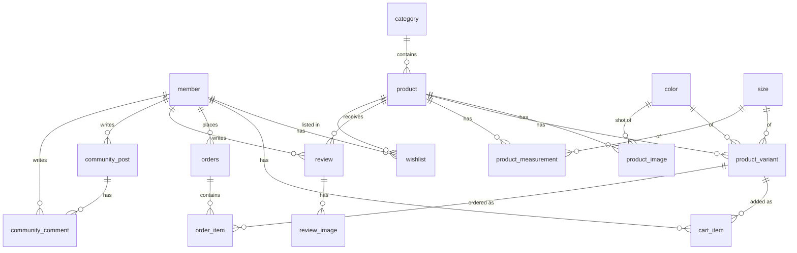

# ARCMETHOD — DB 설계

- **엔진:** PostgreSQL 15+ (identity 컬럼, `updated_at` 트리거)
- **통화:** 원화 정수(KRW)
- **범위:** 개념 데모 — 실제 결제 연동 없음, 주문은 목업
- **DDL:** [`src/main/resources/db/schema.sql`](../src/main/resources/db/schema.sql)

## ERD

## §0 관찰 문제 → 스키마 매핑

| §0 문제 | 스키마 해결 |
|---|---|
| ④ 색/사이즈 필터 없음 | `color`/`size` 마스터 + `product_variant`(색×사이즈 SKU) |
| ④ 호버 대체컷 없음 | `product_image.image_type`(MAIN/HOVER/DETAIL), `color_id` |
| ⑤ PDP 정보 부족 | `product` 소재·관리·두께·신축·비침·안감·모델정보 컬럼 |
| ⑤ 실측 사이즈표 없음 | `product_measurement`(사이즈별 key-value) |
| ⑤ 상품명에 운영메모 혼입 | `is_new`/`is_best` 플래그 + `preorder_ship_date` 분리 |

## 주요 설계 결정
1. **판매단위 = `product_variant`(색×사이즈).** 재고·품절·필터가 모두 여기서 파생.
2. **New/Sale는 카테고리가 아니라 상품 플래그.** 실제 카테고리(Outer/Top/Bottom)와 분리해 위계 정리.
3. **가격 = 정가(`price`) + `discount_rate`(%).** 판매가는 계산값.
4. **`order_item`에 상품명·색·사이즈·가격 스냅샷** 저장 → 주문 이력 불변성 보장.
5. **장바구니는 회원(`member_id`) + 게스트(`session_id`) 겸용.**
